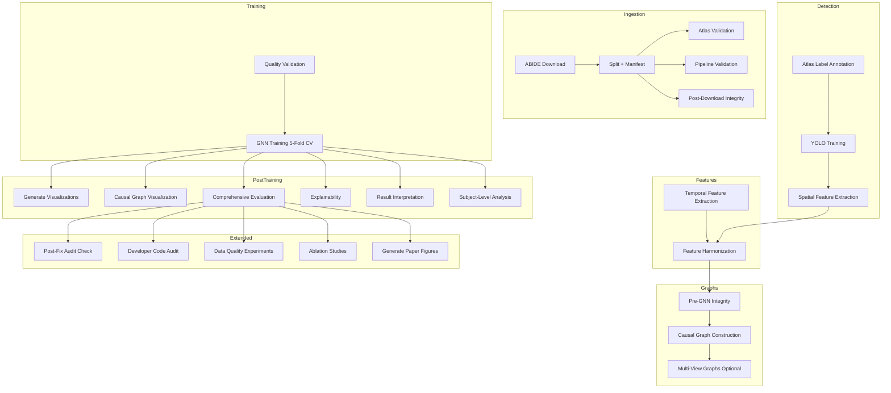

# Architecture

## Overview

Neuro-CXG is a configuration-driven pipeline that turns ABIDE resting-state fMRI into subject-level directed causal graphs and trains a graph classifier with fold-safe preprocessing and post-training interpretability.

The canonical orchestration flow is defined in `src/pipeline/registry.py` and executed by `src/run_pipeline.py`.



## Design Principles

| Principle | Rationale | Establishing Source |
|-----------|-----------|---------------------|
| Configuration-first | Paths, constants, thresholds, and model settings come from `src/core/config.py` re-exports | `src/core/config.py`, DD-001 |
| Fold safety | Harmonization and train-time preprocessing are fit on training partitions only | `src/features/fold_safe_harmonization.py`, DD-007 |
| Robustness through gates | Graph quality and multiview quality gates block or disable unsafe training paths | `src/core/validators.py`, DD-010 |
| Source-of-truth stage metadata | Stage keys, dependencies, and sentinels are defined declaratively in `src/pipeline/registry.py` | `src/pipeline/registry.py`, DD-002 |

## Stage Registry Map

Core stage keys (in execution order):

| Stage Key | Module Path | One-Line Responsibility | Output Sentinel |
|-----------|-------------|------------------------|-----------------|
| download | src.data.abide_download | Pull ABIDE artifacts | data/final/ |
| split | src.data.split | 70/15/15 stratified split + cv_folds | data/metadata/split_manifest.csv |
| manifest | src.data.manifestor | Build master manifest with site/subsample | data/metadata/master_manifest.csv |
| atlas_validation | src.validation.pipeline_checks | Verify 170 ROI overlap | data/metadata/atlas_overlap_report.json |
| pipeline_validation | src.validation.pipeline_checks | Check pipeline readiness | data/metadata/pipeline_ready.flag |
| post_download_integrity | src.validation.pipeline_checks | Validate downloaded assets | data/metadata/download_integrity.json |
| annotate | src.features.annotate_rois | ROI to lobe mapping | data/metadata/roi_lobe_map.csv |
| yolo | src.features.yolo_train | Train YOLO for lobe detection | models/yolo_lobe_detector/ |
| spatial_features | src.features.extract_spatial | Lobe geometric features | data/metadata/node_attributes_spatial.csv |
| temporal_features | src.features.extract_temporal | Lobe temporal/frequency features | data/metadata/node_attributes_temporal.csv |
| harmonization | src.features.fold_safe_harmonization | ComBat harmonization (fold-safe) | data/metadata/harmonized_folds_cv/ |
| pre_gnn_integrity | src.core.validators | Pre-training validation | data/metadata/pre_gnn_ready.flag |
| causal_graphs | src.features.construct_causal | Directed adjacency matrices | data/processed/causal_graphs/ |
| diagnostics | src.validation.pipeline_checks | Runtime diagnostics | data/metadata/diagnostics.json |
| quality_validation | src.validation.pipeline_checks | Quality gates pass | data/metadata/quality_gates_pass.json |
| gnn_training | src.models.gnn_model | 5-fold CV training | results/checkpoints/ |
| visualizations | src.features.visualizations | Plot generation | results/visualizations/ |
| graph_visualization | src.features.graph_visualization | Graph plots | results/graphs/ |
| evaluation | src.run_evaluation | Metrics computation | results/evaluation/ |
| explainability | src.run_explainability | Interpretability | results/explainability/ |
| result_analysis | src.run_result_analysis | Result summary | results/analysis/ |
| subject_analysis | src.run_result_analysis | Per-subject breakdown | results/subject_analysis/ |

Optional/extended stages:

| Stage Key | Purpose |
|-----------|---------|
| site_stratified_cv | GroupKFold over site clusters |
| multiview_graphs | Multi-causal-method graphs |
| dead_lobe_diagnosis | Debug dead lobe subjects |
| audit_check | Strict artifact validation |
| feature_diagnostics | Feature-level diagnostics |

## Component Responsibility Table

| Layer | Component | Primary Files |
|-------|-----------|---------------|
| Orchestration | Stage registry, runner | `src/pipeline/registry.py`, `src/run_pipeline.py` |
| Configuration | Paths, hyperparams, feature registry | `src/core/paths.py`, `src/core/hyperparams.py`, `src/core/feature_registry.py` |
| Data Ingestion | Download, split, manifest | `src/data/abide_download.py`, `src/data/split.py`, `src/data/manifestor.py` |
| Feature Build | Spatial extraction, temporal extraction, harmonization | `src/features/extract_spatial.py`, `src/features/extract_temporal.py`, `src/features/fold_safe_harmonization.py` |
| Graph Build | Causal inference, graph construction | `src/features/construct_causal.py`, `src/features/causal_inference.py` |
| Model & Training | GNN model, factory, training utilities | `src/models/causal_gnn.py`, `src/models/factory.py`, `src/models/gnn_model.py`, `src/models/training_utils.py` |
| Reporting | Evaluation, explainability, result analysis | `src/run_evaluation.py`, `src/run_explainability.py`, `src/run_result_analysis.py` |
| Validation | Pre-flight checks, audit, diagnostics | `src/core/validators.py`, `src/validation/audit_check.py`, `src/validation/pipeline_checks.py` |

## Per-Component Documentation

### 1. Orchestration Component

**Stage Registry (`src/pipeline/registry.py`)**
- Purpose: Declarative stage metadata with immutable stage keys, module paths, dependencies, and output sentinels
- Inputs: None (configuration)
- Outputs: Stage metadata dict accessible to runner
- Critical behavior: `Stage.is_complete()` uses sentinel existence and non-empty directory checks
- Edge-case handling: Missing sentinel triggers stage re-run

**Runner (`src/run_pipeline.py`)**
- Purpose: Execute stages in registry order based on CLI flags and artifact readiness
- Inputs: CLI flags (`--auto`, `--analysis-only`, `--multiview`, `--site-stratified-cv`), registry, existing artifacts
- Outputs: Executed stages with logged results
- Critical behavior: Enforces preflight checks (`validate_environment`) and pre-training checks (`validate_gnn_training_inputs`)
- Edge-case handling: Skips completed stages when sentinel exists

### 2. Configuration Component

**Facade (`src/core/config.py`)**
- Purpose: Stable import surface re-exporting all config modules

**Core Config Modules:**
- `src/core/paths.py`: Canonical paths for data, models, results
- `src/core/feature_registry.py`: Feature groups, active frequency bands, channel count (`GNN_IN_CHANNELS`)
- `src/core/hyperparams.py`: Causality, sparsity, GNN, threshold policy, quality gates
- `src/core/atlas_config.py`: 170 ROI to 12 lobe mapping and optional network hierarchy
- `src/core/validators.py`: Environment, training-input, and degeneracy checks

### 3. Data Ingestion Component

**Download (`src/data/abide_download.py`)**
- Purpose: Pull ABIDE artifacts and produce split-ready assets

**Split (`src/data/split.py`)**
- Purpose: 70/15/15 train/val/test stratified split with 5-fold cv_fold generation
- Output contract: `data/metadata/master_manifest.csv` with split and fold assignments

### 4. Feature Component

**Spatial (`src/features/extract_spatial.py`)**
- Purpose: Lobe-level geometric features (x, y, z_depth, size)
- Inputs: YOLO predictions or atlas fallback
- Outputs: `data/metadata/node_attributes_spatial.csv`
- Edge-case handling: Dead lobe detection marks zero_lobe_mask

**Temporal (`src/features/extract_temporal.py`)**
- Purpose: Lobe-level temporal/frequency features with site-aware TR handling
- Inputs: Time series per subject
- Outputs: `data/metadata/node_attributes_temporal.csv`
- Edge-case handling: Gamma band zeroed at Nyquist for TR=2s

**Harmonization (`src/features/fold_safe_harmonization.py`)**
- Purpose: ComBat harmonization with train-fold fit only
- Inputs: Temporal features, site, age, sex
- Outputs: Per-fold harmonized files + combined export
- Critical behavior: Uses `DX_GROUP` as protected covariate

### 5. Graph Construction Component

**Graph Builder (`src/features/construct_causal.py`)**
- Purpose: Aggregate ROI signals to 12 lobe-level time series, build directed adjacency matrices
- Inputs: Harmonized temporal features, lobe mapping
- Outputs: Per-subject graph packages under `data/processed/causal_graphs/`
- Critical behavior: Configurable causal method (lagged_pearson, ridge_granger)

**Causal Inference Core (`src/features/causal_inference.py`)**
- Purpose: `compute_granger_causality` with CPU/GPU internal pathing
- Edge-case handling: NaN/Inf or short series returns safe zero matrices

### 6. Dataset Assembly Component

**`ABIDECausalDataset` (`src/features/graph_factory.py`)**
- Inputs: Manifest rows, harmonized temporal table, spatial table, per-subject graph package
- Outputs: `torch_geometric.data.Data` with:
  - `x`: Node features (NUM_LOBES, GNN_IN_CHANNELS)
  - `edge_index`, `edge_attr`
  - `y`: Label
  - `site_id`, demographics, `sub_id`, `zero_lobe_mask`
- Guards: Skips invalid/degenerate graph subjects, checks shape/NaN/Inf consistency

### 7. Model Component

**CausalBrainGNN (`src/models/causal_gnn.py`)**
- Purpose: GATv2-based binary classifier for ASD vs Control
- Inputs: Node features (12 lobes × 24-28 channels), directed edge adjacency
- Architecture:
  - GATv2Conv: 2 layers, 2-4 attention heads, 32-128 hidden channels
  - Activation: GELU
  - Skip connections: Residual add between layers
  - Edge gating: Weight incoming messages by edge attributes
- Pooling modes:
  - `attention`: Learnable node attention (default)
  - `mean_max_sum`: Concatenation of mean, max, sum pooled
  - `anatomical`: 2-level hierarchy (lobes → networks → graph)
- Domain adaptation: GRL with `GNN_GRL_ALPHA = 0.10` (NOT 1.0)
- Outputs: Logits (batch_size, 2), optional embeddings

### 8. Training Component

**Training Loop (`src/models/gnn_model.py`)**
- Purpose: 5-fold CV training with fold-specific harmonized features
- Inputs: ABIDECausalDataset, fold assignments from manifest
- Critical behavior: Per-fold harmonized file requirement (`harmonized_fold_<k>.csv`)
- Quality gates: Base graph degeneracy rate, multiview quality gate

**Training Utilities (`src/models/training_utils.py`)**
- Purpose: OneCycle schedule, checkpointing, early stopping
- Key classes: `EarlyStopping`, `CheckpointManager`, `TrainingTracker`

### 9. Reporting Components

**Evaluation (`src/run_evaluation.py`)**
- Purpose: Fold-ensemble scoring, bootstrap CI, permutation testing
- Outputs: JSON/CSV in `results/evaluation/`

**Explainability (`src/run_explainability.py`)**
- Purpose: Node, edge, feature, literature phases
- Outputs: `results/explainability/` with `summary.json`

**Result Analysis (`src/run_result_analysis.py`)**
- Purpose: Per-subject predictions, site effects, calibration diagnostics
- Outputs: `result_analysis_summary.json`

## Data Contracts

### 1. Subject Time Series

- Input artifact: `data/final/<split>/time_series/<subject>_ts.npy`
- Expected shape: `(T, 170)`
- Companion labels: `<subject>_roi_labels.npy`

### 2. Temporal Features

- Output artifact: `data/metadata/node_attributes_temporal.csv`
- Encoding: ROI-level columns `roi{1..170}_{feature}`
- Feature groups from `FEATURE_GROUPS` in `src/core/feature_registry.py`
- Ordering constraint: Must follow `FEATURE_ORDER` for channel alignment

### 3. Fold-Safe Harmonization Outputs

- Per-fold: `data/metadata/harmonized_folds_cv/harmonized_fold_<k>.csv`
- Combined no-leak export: `data/metadata/node_attributes_harmonized.csv`
- Spatial harmonization export: `data/metadata/node_features_3d_harmonized.csv`

### 4. Causal Graph Package

Each subject graph in `data/processed/causal_graphs/<subject>_graph.pt` contains:

```python
{
    "adj": Tensor(12, 12),              # Directed adjacency
    "internal_features": Tensor(12, 2), # Coherence, spatial variance
    "zero_lobe_mask": Tensor(12,),      # Dead lobe sentinel
    "edge_confidence": Tensor(12, 12),  # Causality confidence
    "edge_pvalues": Tensor(12, 12),     # Granger causality p-values
    "selected_lag_matrix": Tensor(12, 12), # Optimal lag per pair
    "low_confidence_mask": Tensor(12, 12), # Mask for unreliable edges
    "subject_id": str,
    "lobe_order": List[str],             # Ordered lobe names
    "sparsification_info": Dict[str, Any],
    "stats": Dict[str, Any],
}
```

### 5. Dataset Assembly Contract

`ABIDECausalDataset` combines:
- Harmonized temporal features
- Internal graph features (`coherence`, `spatial_variance`)
- Spatial features (`x`, `y`, `z_depth`, `size`)

Into node tensor `x` with shape `(NUM_LOBES, GNN_IN_CHANNELS)`.

## Model Architecture

### Core Model: CausalBrainGNN

**Input Shape:**
- Nodes: 12 brain lobes (12-lobe architecture, approved for publication — DD-018)
- Node features: 24 dimensions (18 temporal + 2 internal + 4 spatial) [UPDATED — was 8 temporal + 10 frequency, now 18 temporal (8 base + 10 frequency) per feature_registry.py]
- Edges: Directed causal adjacency (ridge_granger_hybrid, β=0.70)
- Edge attributes: 1 dimension (causality weight)

**Architecture Details:**
- Backbone: GATv2Conv (3 layers, 4 attention heads, 48 hidden channels)
- Activation: GELU
- Skip connections: Residual add between layers
- Edge gating: Weight incoming messages by edge attributes

**Pooling Modes (configurable):**
- `attention`: Learnable node attention (default, stable)
- `mean_max_sum`: Concatenation of mean, max, and sum pooled embeddings
- `anatomical`: 2-level hierarchy (lobes → networks → graph)

**Domain Adaptation:**
- Gradient Reversal Layer (GRL) for site-adversarial debiasing
- Site embedding + demographic conditioning inputs
- Configured via `GNN_GRL_ALPHA = 0.10` (⚠️ critical: do NOT set to 1.0)

**Output:**
- Logits: Shape `(batch_size, 2)` for binary classification (ASD vs Control)
- Optional: Embeddings for explainability

**Per-Fold Results** (config hash `6b6ca55b`, run log `12lobes.txt`):

| Fold | Train/Val | AUC | F1 | Best Epoch | Threshold |
|------|-----------|--------|-----|------------|-----------|
| 1 | 565/142 | 0.8027 | 0.7671 | 53 | 0.6158 |
| 2 | 565/142 | 0.7841 | 0.7500 | 50 | 0.6568 |
| 3 | 566/141 | 0.8062 | 0.7682 | 36 | 0.6990 |
| 4 | 566/141 | 0.7953 | 0.6829 | 29 | 0.6622 |
| 5 | 566/141 | 0.8626 | 0.7692 | 37 | 0.6289 |

**CV Summary**: 0.8102 ± 0.0273 (mean ± std), mean F1=0.7475 ± 0.0331

**Data flow reference**: See `docs/dataflow.md` for complete 29-stage end-to-end data transformation.

## Loss Functions

### Primary Loss: FocalLoss

**Purpose:** Address class imbalance and hard-example mining in binary classification.

**Algorithm:**
1. Compute softmax probabilities from logits
2. One-hot encode targets
3. Extract class probability: $p_t = \text{softmax}(logits)[class]$
4. Focal weight: $(1 - p_t)^{\gamma}$ — upweight hard negatives
5. Alpha weight: Per-class balance factor
6. Combined loss: $\text{CrossEntropy} \times \text{alpha\_weight} \times \text{focal\_weight}$

**Default Configuration (from `src/core/hyperparams.py`):**
- `FOCAL_LOSS_ALPHA = 0.50` — class 1 weight (ASD)
- `FOCAL_LOSS_GAMMA = 1.5` — focusing parameter
- `pos_weight` = computed class imbalance ratio

**Rationale:** ABIDE dataset has mild imbalance (~486 ASD / ~514 Control). Focal loss emphasizes hard samples during training and outperforms standard cross-entropy.

### Auxiliary Losses

When multiview graphs are available and pass quality gates:

| Loss | Type | Temperature | Weight | Purpose |
|------|------|-------------|--------|---------|
| CausalInvarianceLoss | NT-Xent | 0.07 | 0.15 | Consistent predictions across causal graph estimates |
| SpatialInvarianceLoss | MSE | — | — | Guard against site-specific spatial artifacts |
| EdgeStructureContrastiveLoss | NT-Xent | 0.5 | 0.05 | Edge structure as primary classification signal |

## Training Loop Patterns

### 5-Fold Cross-Validation

```python
from src.features.graph_factory import ABIDECausalDataset

dataset = ABIDECausalDataset(split='train')
manifest = dataset.manifest

for fold_id in range(5):
    train_idx = manifest[manifest['fold'] != fold_id].index
    val_idx = manifest[manifest['fold'] == fold_id].index
    
    # Load fold-specific harmonized features
    fold_features = pd.read_csv(f'data/metadata/harmonized_folds_cv/harmonized_fold_{fold_id}.csv')
    
    train_fold(fold_id, train_idx, val_idx, fold_features)
```

### OneCycle LR Schedule

| Parameter | Value |
|-----------|-------|
| max_lr | 0.002 (configurable via `GNN_ONECYCLE_MAX_LR`) |
| pct_start | 0.2 (20% increase, 80% decrease) |
| Rationale | High initial LR → explore loss landscape; gradual decrease → converge |

### Early Stopping

| Parameter | Value |
|-----------|-------|
| patience | 30 epochs (`GNN_EARLY_STOPPING_PATIENCE`) |
| mode | max (maximize validation AUC) |
| Monitor | Validation AUC |

### Checkpointing

- Saves best model per fold by validation AUC
- Stores: model state, optimizer state, epoch, metrics
- Loads with strict=False for backward compatibility

## Quality Gates and Safety Checks

| Gate | What It Enforces | Where Enforced |
|------|------------------|-----------------|
| Missing harmonization files | Training blocked if per-fold harmonized CSV missing | `validate_gnn_training_inputs()` in `src/core/validators.py` |
| Graph degeneracy | Excessive dead graphs (>50%) blocks training | `src/core/validators.py:validate_graph_construction_inputs()` |
| Multiview quality | Degenerate multiview branches disabled | `src/features/construct_multiview.py` |
| Subject alignment | Graph factory checks shape/NaN/Inf | `src/features/graph_factory.py:ABIDECausalDataset` |
| Pre-flight checks | Environment validation before any run | `validate_environment()` in `src/core/validators.py` |

## Component Change Rules

| If You Change... | Then You Must Also Update... |
|------------------|------------------------------|
| Stage behavior | `src/pipeline/registry.py` + runner logic in `src/run_pipeline.py` |
| Feature channels | `src/core/feature_registry.py` + `ABIDECausalDataset` shape checks |
| Training prerequisites | `validate_gnn_training_inputs()` in `src/core/validators.py` |
| Output artifact names | Sentinels in `src/pipeline/registry.py` + docs |
| Lobe mapping | `src/core/atlas_config.py` + downstream feature consumers |
| Config constants | All importing modules (use `config.py` facade) |

---