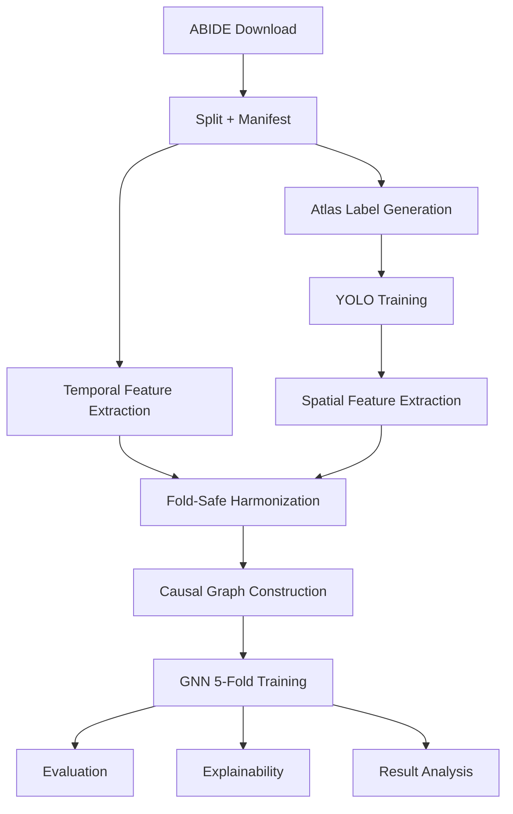

# Architecture

## Overview

Neuro-CXG is a configuration-driven pipeline that turns ABIDE resting-state fMRI into subject-level directed causal graphs and trains a graph classifier with fold-safe preprocessing and post-training interpretability.

The canonical orchestration flow is defined in `src/pipeline/registry.py` and executed by `src/run_pipeline.py`.



## Design Principles

- Configuration-first: paths, constants, thresholds, and model settings come from `src/core/config.py` re-exports.
- Fold safety: harmonization and train-time preprocessing are fit on training partitions only.
- Robustness through gates: graph quality and multiview quality gates block or disable unsafe training paths.
- Source-of-truth stage metadata: stage keys, dependencies, and sentinels are defined declaratively in `src/pipeline/registry.py`.

## Runtime Orchestration

`src/run_pipeline.py` builds execution decisions from:

- Stage registry (`src/pipeline/registry.py`)
- Existing artifacts (sentinel checks)
- CLI flags (`--auto`, `--analysis-only`, `--multiview`, `--site-stratified-cv`, and skip flags)

The runner executes module entry points in registry order and supports:

- Optional site-stratified CV fold reassignment stage (`site_stratified_cv`)
- Optional multiview graph generation stage (`multiview_graphs`)
- Post-training-only paths (`--analysis-only`, `--visualizations-only`)
- Strict preflight checks before training (`validate_gnn_training_inputs`)

## Stage Registry Map

Core stage keys (in order):

1. `download`
2. `split`
3. `manifest`
4. `atlas_validation`
5. `pipeline_validation`
6. `post_download_integrity`
7. `annotate`
8. `yolo`
9. `spatial_features`
10. `temporal_features`
11. `harmonization`
12. `pre_gnn_integrity`
13. `causal_graphs`
14. `diagnostics`
15. `quality_validation`
16. `gnn_training`
17. `visualizations`
18. `graph_visualization`
19. `evaluation`
20. `explainability`
21. `result_analysis`
22. `subject_analysis`

Optional/extended stage keys:

- `site_stratified_cv`
- `multiview_graphs`
- `dead_lobe_diagnosis`
- `audit_check`
- `dev_audit`
- `feature_diagnostics`
- `data_quality_experiments`
- `ablation_studies`

## Data Contracts

### 1) Subject time series

- Input artifact: `data/final/<split>/time_series/<subject>_ts.npy`
- Expected shape: `(T, 170)`
- Companion labels: `<subject>_roi_labels.npy`

### 2) Temporal features

- Output artifact: `data/metadata/node_attributes_temporal.csv`
- Encoding: ROI-level columns `roi{1..170}_{feature}`
- Feature groups come from `FEATURE_GROUPS` in `src/core/feature_registry.py`

### 3) Fold-safe harmonization outputs

- Per-fold: `data/metadata/harmonized_folds_cv/harmonized_fold_<k>.csv`
- Combined no-leak export: `data/metadata/node_attributes_harmonized.csv`
- Spatial harmonization export: `data/metadata/node_features_3d_harmonized.csv`

### 4) Causal graph package

Each subject graph in `data/processed/causal_graphs/<subject>_graph.pt` contains:

```python
{
    "adj": Tensor(12, 12),
    "internal_features": Tensor(12, 2),
    "zero_lobe_mask": Tensor(12,),
    "edge_confidence": Tensor(12, 12),
    "edge_pvalues": Tensor(12, 12),
    "selected_lag_matrix": Tensor(12, 12),
    "low_confidence_mask": Tensor(12, 12),
    "subject_id": str,
    "lobe_order": List[str],
    "sparsification_info": Dict[str, Any],
    "stats": Dict[str, Any],
}
```

### 5) Dataset assembly contract

`ABIDECausalDataset` in `src/features/graph_factory.py` combines:

- Harmonized temporal features
- Internal graph features (`coherence`, `spatial_variance`)
- Spatial features (`x`, `y`, `z_depth`, `size`)

into node tensor `x` with shape `(NUM_LOBES, GNN_IN_CHANNELS)`.

## Model Architecture Path

- Model factory: `src/models/factory.py`
- Main architecture: `src/models/causal_gnn.py`
- Training loop: `src/models/gnn_model.py`
- Shared training utilities: `src/models/training_utils.py`

Training includes:

- 5-fold CV from manifest `cv_fold`
- Fold-specific harmonized temporal inputs
- Optional GRL site-adversarial path
- Optional multiview invariance loss (only when multiview artifacts are present and pass quality checks)

## Quality Gates And Safety Checks

The architecture intentionally fails fast on unsafe inputs:

- Missing fold harmonization files before training
- Excessive degenerate graph rate (graph quality gate)
- Degenerate non-base multiview branches (multiview quality gate)
- Subject alignment and graph integrity checks in `ABIDECausalDataset`

These checks are designed to prevent silent leakage, degenerate training runs, and brittle outputs.
