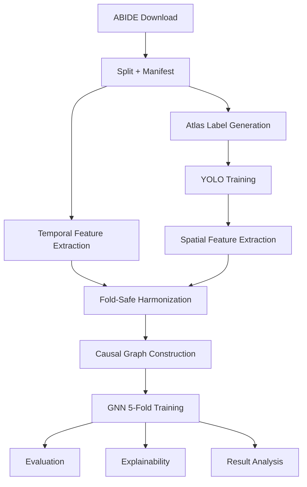

# Architecture

## Overview

Neuro-CXG is a configuration-driven pipeline that turns ABIDE resting-state fMRI into subject-level directed causal graphs and trains a graph classifier with fold-safe preprocessing and post-training interpretability.

The canonical orchestration flow is defined in `src/pipeline/registry.py` and executed by `src/run_pipeline.py`.



## Design Principles

- Configuration-first: paths, constants, thresholds, and model settings come from `src/core/config.py` re-exports.
- Fold safety: harmonization and train-time preprocessing are fit on training partitions only.
- Robustness through gates: graph quality and multiview quality gates block or disable unsafe training paths.
- Source-of-truth stage metadata: stage keys, dependencies, and sentinels are defined declaratively in `src/pipeline/registry.py`.

## Runtime Orchestration

`src/run_pipeline.py` builds execution decisions from:

- Stage registry (`src/pipeline/registry.py`)
- Existing artifacts (sentinel checks)
- CLI flags (`--auto`, `--analysis-only`, `--multiview`, `--site-stratified-cv`, and skip flags)

The runner executes module entry points in registry order and supports:

- Optional site-stratified CV fold reassignment stage (`site_stratified_cv`)
- Optional multiview graph generation stage (`multiview_graphs`)
- Post-training-only paths (`--analysis-only`, `--visualizations-only`)
- Strict preflight checks before training (`validate_gnn_training_inputs`)

## Stage Registry Map

Core stage keys (in order):

1. `download`
2. `split`
3. `manifest`
4. `atlas_validation`
5. `pipeline_validation`
6. `post_download_integrity`
7. `annotate`
8. `yolo`
9. `spatial_features`
10. `temporal_features`
11. `harmonization`
12. `pre_gnn_integrity`
13. `causal_graphs`
14. `diagnostics`
15. `quality_validation`
16. `gnn_training`
17. `visualizations`
18. `graph_visualization`
19. `evaluation`
20. `explainability`
21. `result_analysis`
22. `subject_analysis`

Optional/extended stage keys:

- `site_stratified_cv`
- `multiview_graphs`
- `dead_lobe_diagnosis`
- `audit_check`
- `dev_audit`
- `feature_diagnostics`
- `data_quality_experiments`
- `ablation_studies`

## Component Responsibility Table

| Layer | Component | Primary files |
|-------|-----------|---------------|
| **Orchestration** | Stage registry, runner | `src/pipeline/registry.py`, `src/run_pipeline.py` |
| **Configuration** | Paths, hyperparams, feature registry | `src/core/paths.py`, `src/core/hyperparams.py`, `src/core/feature_registry.py` |
| **Data Ingestion** | Download, split, manifest | `src/data/abide_download.py`, `src/data/split.py`, `src/data/manifestor.py` |
| **Feature Build** | Spatial extraction, temporal extraction, harmonization | `src/features/extract_spatial.py`, `src/features/extract_temporal.py`, `src/features/fold_safe_harmonization.py` |
| **Graph Build** | Causal inference, graph construction | `src/features/construct_causal.py`, `src/features/causal_inference.py` |
| **Model & Training** | GNN model, factory, training utilities | `src/models/causal_gnn.py`, `src/models/factory.py`, `src/models/gnn_model.py`, `src/models/training_utils.py` |
| **Reporting** | Evaluation, explainability, result analysis | `src/run_evaluation.py`, `src/run_explainability.py`, `src/run_result_analysis.py` |
| **Validation** | Pre-flight checks, audit, diagnostics | `src/core/validators.py`, `src/validation/audit_check.py`, `src/validation/pipeline_checks.py` |

## Data Contracts

### 1) Subject time series

- Input artifact: `data/final/<split>/time_series/<subject>_ts.npy`
- Expected shape: `(T, 170)`
- Companion labels: `<subject>_roi_labels.npy`

### 2) Temporal features

- Output artifact: `data/metadata/node_attributes_temporal.csv`
- Encoding: ROI-level columns `roi{1..170}_{feature}`
- Feature groups come from `FEATURE_GROUPS` in `src/core/feature_registry.py`

### 3) Fold-safe harmonization outputs

- Per-fold: `data/metadata/harmonized_folds_cv/harmonized_fold_<k>.csv`
- Combined no-leak export: `data/metadata/node_attributes_harmonized.csv`
- Spatial harmonization export: `data/metadata/node_features_3d_harmonized.csv`

### 4) Causal graph package

Each subject graph in `data/processed/causal_graphs/<subject>_graph.pt` contains:

```python
{
    "adj": Tensor(12, 12),
    "internal_features": Tensor(12, 2),
    "zero_lobe_mask": Tensor(12,),
    "edge_confidence": Tensor(12, 12),
    "edge_pvalues": Tensor(12, 12),
    "selected_lag_matrix": Tensor(12, 12),
    "low_confidence_mask": Tensor(12, 12),
    "subject_id": str,
    "lobe_order": List[str],
    "sparsification_info": Dict[str, Any],
    "stats": Dict[str, Any],
}
```

### 5) Dataset assembly contract

`ABIDECausalDataset` in `src/features/graph_factory.py` combines:

- Harmonized temporal features
- Internal graph features (`coherence`, `spatial_variance`)
- Spatial features (`x`, `y`, `z_depth`, `size`)

into node tensor `x` with shape `(NUM_LOBES, GNN_IN_CHANNELS)`.

## Model Architecture Path

- Model factory: `src/models/factory.py`
- Main architecture: `src/models/causal_gnn.py`
- Training loop: `src/models/gnn_model.py`
- Shared training utilities: `src/models/training_utils.py`

Training includes:

- 5-fold CV from manifest `cv_fold`
- Fold-specific harmonized temporal inputs
- Optional GRL site-adversarial path
- Optional multiview invariance loss (only when multiview artifacts are present and pass quality checks)

## Quality Gates And Safety Checks

The architecture intentionally fails fast on unsafe inputs:

- Missing fold harmonization files before training
- Excessive degenerate graph rate (graph quality gate)
- Degenerate non-base multiview branches (multiview quality gate)
- Subject alignment and graph integrity checks in `ABIDECausalDataset`

These checks are designed to prevent silent leakage, degenerate training runs, and brittle outputs.

---

## Model Architecture

### Core Model: CausalBrainGNN

The model is defined in `src/models/causal_gnn.py` and instantiated by `src/models/factory.py`.

**Input Shape:**
- Nodes: 12 brain lobes (12-lobe architecture)
- Node features: 24 dimensions (8 temporal + 10 frequency + 2 internal + 4 spatial)
- Edges: directed causal adjacency (lagged Pearson correlation)
- Edge attributes: 1 dimension (causality weight)

**Architecture Details:**
- **Backbone**: GATv2Conv (2 layers, 2 attention heads, 32 hidden channels)
- **Activation**: GELU
- **Skip connections**: residual add between layers
- **Edge gating**: weight incoming messages by edge attributes

**Pooling Modes (configurable):**
- `"attention"`: learnable node attention (default, stable)
- `"mean_max_sum"`: concatenation of mean, max, and sum pooled embeddings
- `"anatomical"`: 2-level hierarchy (lobes → networks → graph), with `AnatomicalHierarchyPool`

**Domain Adaptation:**
- Gradient Reversal Layer (GRL) for site-adversarial debiasing
- Site embedding + demographic conditioning inputs
- Configured via `GNN_GRL_ALPHA = 0.10` (conservative, NOT 1.0)

**Output:**
- Logits: shape `(batch_size, 2)` for binary classification (ASD vs Control)
- Optional: embeddings for explainability

---

## Loss Functions

### Primary Loss: FocalLoss

Purpose: Address class imbalance and hard-example mining in binary classification.

**Algorithm:**
1. Compute softmax probabilities from logits
2. One-hot encode targets
3. Extract class probability: $p_t = \text{softmax}(logits)[class]$
4. Focal weight: $(1 - p_t)^{\gamma}$ — upweight hard negatives
5. Alpha weight: per-class balance factor
6. Combined loss: $\text{CrossEntropy} \times \text{alpha\_weight} \times \text{focal\_weight}$

**Default Configuration:**
- `FOCAL_LOSS_ALPHA = 0.50` — class 1 weight (ASD)
- `FOCAL_LOSS_GAMMA = 1.5` — focusing parameter
- `pos_weight` = computed class imbalance ratio

**Rationale:** ABIDE dataset has mild imbalance (~59% ASD / ~41% Control). Focal loss emphasizes hard samples during training and outperforms standard cross-entropy.

### Auxiliary Losses

When multiview graphs are available and pass quality gates:

**CausalInvarianceLoss:**
- Purpose: Ensure consistent predictions across different causal graph estimates
- Type: NT-Xent loss
- Temperature τ = 0.07
- Weight: 0.15

**SpatialInvarianceLoss:**
- Purpose: Guard against site-specific spatial artifacts
- Ensures residual site variance after adversarial training is minimized

**EdgeStructureContrastiveLoss:**
- Purpose: Enforce edge structure as primary classification signal
- Type: NT-Xent loss between full-feature and edge-only embeddings
- Temperature τ = 0.5
- Weight: 0.05

---

## Training Loop Patterns

### 5-Fold Cross-Validation

```python
from src.features.graph_factory import ABIDECausalDataset
from sklearn.model_selection import StratifiedKFold

dataset = ABIDECausalDataset(split='train')
manifest = dataset.manifest

for fold_id in range(5):
    train_idx = manifest[manifest['fold'] != fold_id].index
    val_idx = manifest[manifest['fold'] == fold_id].index
    
    # Load fold-specific harmonized features
    fold_features = pd.read_csv(f'data/metadata/harmonized_folds_cv/harmonized_fold_{fold_id}.csv')
    
    train_fold(fold_id, train_idx, val_idx, fold_features)
```

### OneCycle LR Schedule

- `max_lr`: 0.002 (configurable)
- `pct_start`: 0.2 (20% of epochs increase, 80% decrease)
- High initial LR → explore loss landscape; gradual decrease → converge

### Early Stopping

- `patience`: 30 epochs
- `mode`: max (maximize validation AUC)
- Monitors validation AUC; stops if no improvement within patience

### Checkpointing

- Saves best model per fold by validation AUC
- Stores: model state, optimizer state, epoch, metrics
- Loads with strict=False for backward compatibility

---

## Component Change Rules

When updating a component, keep these invariants synchronized:

| If You Change... | Then You Must Also Update... |
|------------------|---------------------------|
| Stage behavior | `src/pipeline/registry.py` + runner logic |
| Feature channels | `src/core/feature_registry.py` + `ABIDECausalDataset` shape checks |
| Training prerequisites | `validate_gnn_training_inputs()` in `src/core/validators.py` |
| Output artifact names | Sentinels in `registry.py` + docs |
| Lobe mapping | `src/core/atlas_config.py` + downstream feature consumers |
| Config constants | All importing modules (use config.py facade) |
