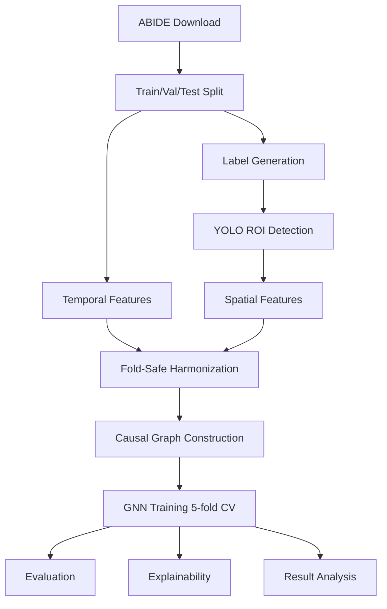

# Architecture

## System Overview
Neuro-CXG is a staged ML pipeline that transforms resting-state fMRI into directed causal graphs and trains a GATv2 classifier.



## Core Modules and Responsibilities
- src/core: central config modules, validators, experiment tracker.
- src/data: data acquisition and split logic.
- src/pipelines: YOLO labeling/training stages.
- src/features: temporal/spatial feature extraction, harmonization, graph construction, dataset assembly.
- src/models: GNN architecture, training orchestration, evaluation utilities, model factory.
- src/analysis: visualizations and interpretability.
- src/validation: integrity checks and audits.

## Pipeline Stages (Registry-Aligned)
Execution order is declared in src/pipeline/registry.py and consumed by src/run_pipeline.py.

1. Download and split preparation
2. Manifest and atlas validation
3. Label generation and ROI detection
4. Spatial and temporal feature extraction
5. Fold-safe harmonization
6. Causal graph construction
7. Diagnostics and quality validation
8. GNN training
9. Evaluation, explainability, and analysis

For exact stage metadata, module mapping, and completion sentinels, use src/pipeline/registry.py.

## Data Flow Contracts
1. Time series input
- Shape per subject: (T, 170) ROI matrix.
- Source: data/final/<split>/time_series/*_ts.npy.

2. Feature tables
- Temporal harmonized features are loaded into graph_factory.
- Spatial features are joined per subject/lobe.

3. Graph artifact
- One graph file per subject in data/processed/causal_graphs.
- Contains directed adjacency and internal features.

4. Model input
- PyG Data object assembled at load time.
- Node feature channels are config-driven from src/core/feature_registry.py.

## Data Shapes Reference
| Artifact | Shape | Notes |
|---|---|---|
| Raw ROI time series | (T, 170) | Site-dependent T |
| Lobe time series | (T, 12) | Post-aggregation per lobe |
| Internal features | (12, 2) | coherence and spatial_variance |
| Causal adjacency | (12, 12) | Directed weighted matrix |
| Node feature tensor x | (12, GNN_IN_CHANNELS) | GNN_IN_CHANNELS is config-driven |
| edge_index | (2, E) | COO sparse graph edges |
| edge_attr | (E, 1) | Edge weights |
| Model logits | (B, 2) | Binary class logits |

## Graph Artifact Contract
Graph files in data/processed/causal_graphs are dictionary payloads, then converted to PyG Data on load.

```python
{
    "adj": Tensor(12, 12),
    "internal_features": Tensor(12, 2),
    "subject_id": str,
    "lobe_order": list,
}
```

## Model Architecture Notes
- Backbone: GATv2-based graph classifier with skip connections.
- Pooling: anatomical hierarchical pooling by default.
- Optional conditioning: site embedding and demographics.
- Optional adversarial head: GRL-based site classifier.
- Convenience API: forward_batch(batch) for direct PyG batch forwarding.

## Key Runtime Invariants
- All downstream loaders assume complete lobe coverage and stable feature ordering.
- Harmonization must remain fold-safe to avoid leakage.
- Paths and hyperparameters must be imported from src/core/config.py exports.

## Design Principles
- Config-driven constants and paths (single source of truth).
- Leakage prevention for cross-validation and harmonization.
- Graceful fallbacks when data quality is degraded.
- Explainability as first-class output.

## Runtime Orchestration
- src/run_pipeline.py executes stages in declarative order from src/pipeline/registry.py.
- Each stage has module metadata and optional sentinel completion checks.
- GNN training now performs an explicit input preflight so missing harmonized fold artifacts are caught before training begins.

## Why This Architecture
- Supports reproducibility and modular debugging.
- Keeps heavy preprocessing and model training decoupled.
- Enables independent re-runs of expensive stages.
