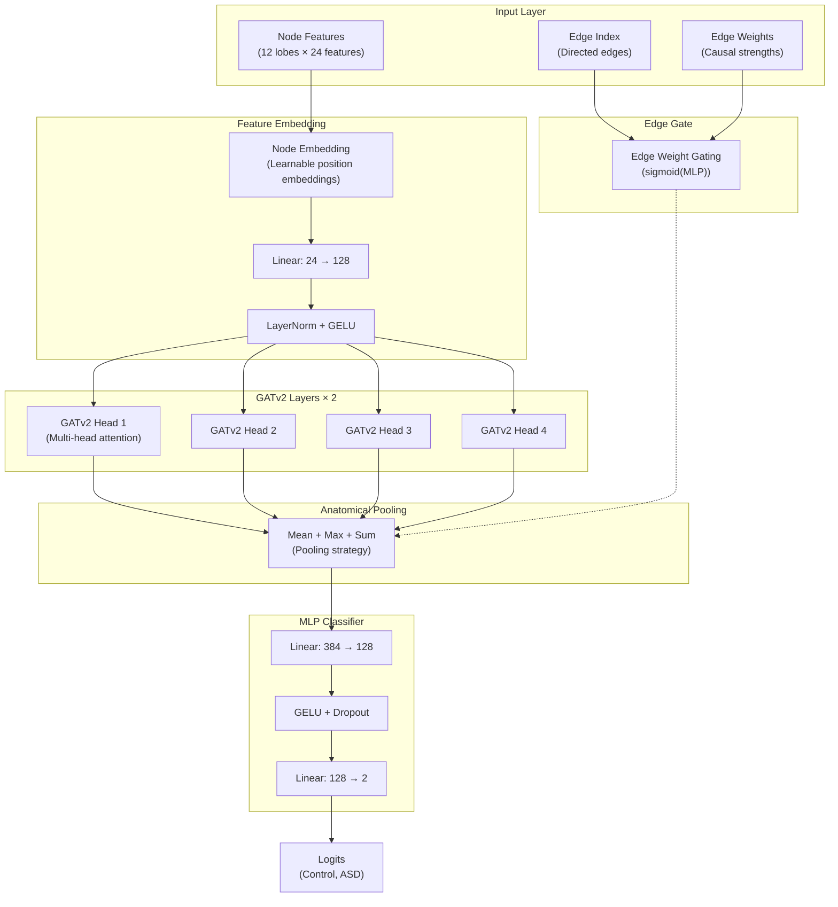

# GNN Architecture

## Forward Pass Architecture

## Component Details

| Component | Shape | Description |
|-----------|-------|-------------|
| Node Features | (batch, 12, 24) | 12 lobes × 24 features (temporal + frequency + spatial) |
| Node Embedding | (batch, 12, 16) | Learnable positional embeddings per lobe |
| Linear (in) | (24 + 16) → 128 | Project to hidden dimension |
| GATv2 Layers | 2 layers × 4 heads | Multi-head self-attention with edge gating |
| Edge Gate | MLP(sigmoid) | Learnable edge weight modulation |
| Pooling | mean + max + sum | Concatenate three pooling strategies → 384-dim |
| Classifier MLP | 384 → 128 → 2 | Final classification head |

## Optional Components

- **Site Embedding**: 20-dim site ID → learned embedding (enabled with `use_site_embedding=True`)
- **Demographics**: Age, sex, FIQ concatenated before classifier (enabled with `use_demographics=True`)
- **Gradient Reversal Layer (GRL)**: Domain adversarial training for site debiasing (enabled with `use_grl=True`)